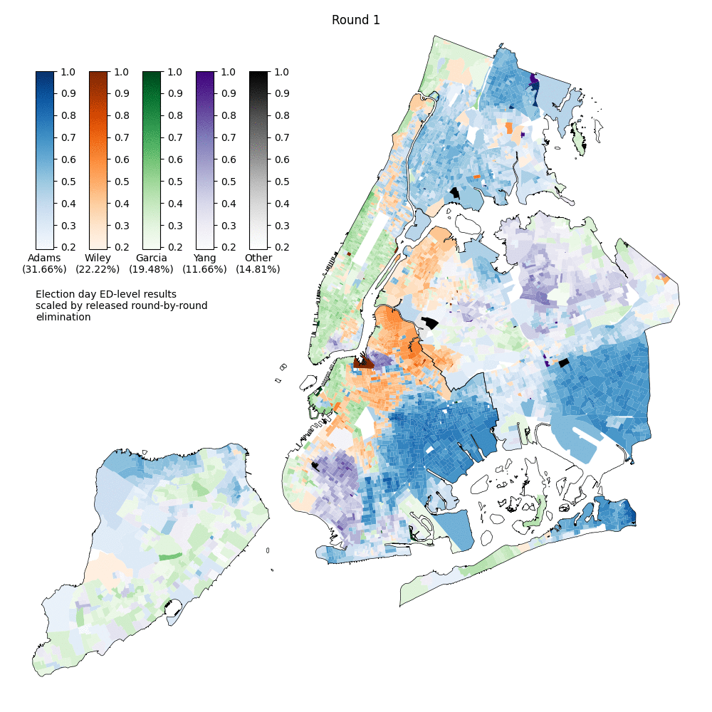

Ex Wiley: 226,575 votes total at elimination. 161,171 were redistributed so each Wiley vote is considered ~0.711 of a vote. Garcia got ~72%, Adams ~27% of the active votes. Garcia gets ~0.51 votes for each Wiley voter, Adams gets ~.19 vote/Wiley voter.

[Election District level Election Night data](https://web.enrboenyc.us/CD24306ADI0.html)

[RCV Round Results](https://web.enrboenyc.us/rcv/)

[NYC ED Shapefile](https://www1.nyc.gov/site/planning/data-maps/open-data/districts-download-metadata.page)
